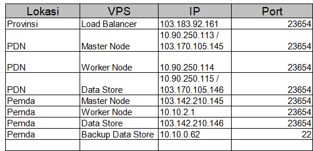

VPS
u / p : wicaksu / Kub3rnatez@@319Grez
\*login untuk semua vps sama

VPN Pemda
Vpn
Host/IP : 103.142.210.136
type : l2tp with preshare key
presherkey : kominfo-grez
user : wicaksu
pass : cakwiGrez_56

Range IP untuk Kubernates :
10.10.2.0 /22 , Gateway : 10.10.0.1

server {
listen 80;
server_name gql.wicak.id;

    access_log /var/log/nginx/gql.wicak.id_access.log;
    error_log /var/log/nginx/gql.wicak.id_error_443.log;

    location / {
        proxy_pass http://localhost:3000;
        proxy_set_header Host $host;
        proxy_set_header X-Real-IP $remote_addr;
        proxy_set_header X-Forwarded-For $proxy_add_x_forwarded_for;
        proxy_set_header X-Forwarded-Proto $scheme;

        # Add security headers
        add_header X-Content-Type-Options nosniff;
        add_header X-Frame-Options DENY;
        add_header X-XSS-Protection "1; mode=block";
        add_header Content-Security-Policy "default-src 'self'; script-src 'self' 'unsafe-inline';       style-src 'self' 'unsafe-inline';";

    }

}
